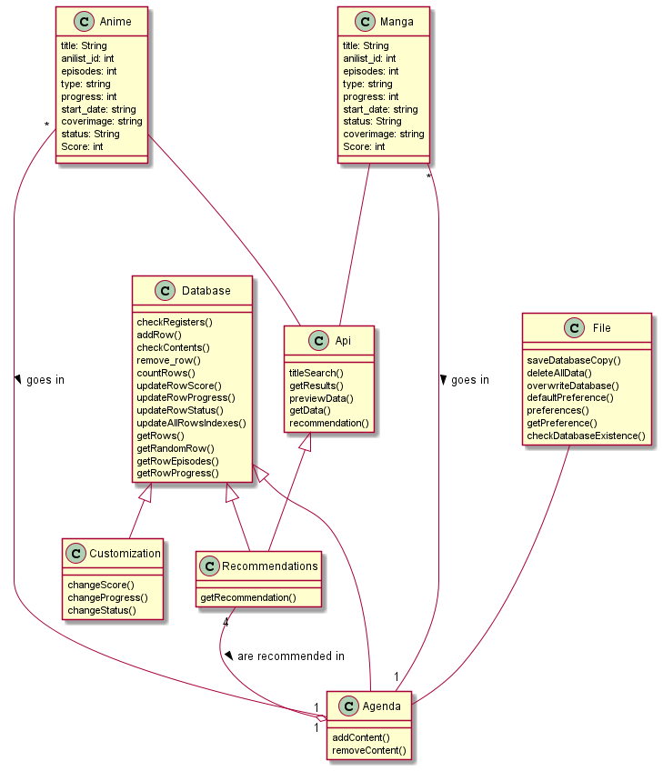

 
 

 # Animack

 <h4>
   Keep track of your anime & manga shows.
 </h4>

 
 
 
 
     

## Demo

## Overview

### What Animack does (functional requirements)

It will provide you with basic functionalities of an anime & manga app tracker. It will:

1. `Search` for a anime or manga given a specific or general title.
2. Give you the option to `add the show` to your list.
3. Give you the ability to `edit`/`track` your progress on a show manually in 'My List' section.
4. Give you the option to `rate` the selected show on a scale of 10.
5. And finally, your list is saved on a sigle file which you can `export` and save elsewhere or `import` another file.

### Class diagram

  

 

## Installation

### Source code

We highly recommend using <a href="https://pyinstaller.org/en/stable/index.html">pyinstaller</a> to make the executable for your system. Read their manual to know how to bundle a Python application and all its dependencies (see <a href="https://github.com/Torrex123/Animack/blob/main/requirements.txt">requirements.txt</a>).

### Pre-built binaries

#### Windows

Go to <a href="https://github.com/Torrex123/Animack/releases">releases page</a> and download the latest version.
