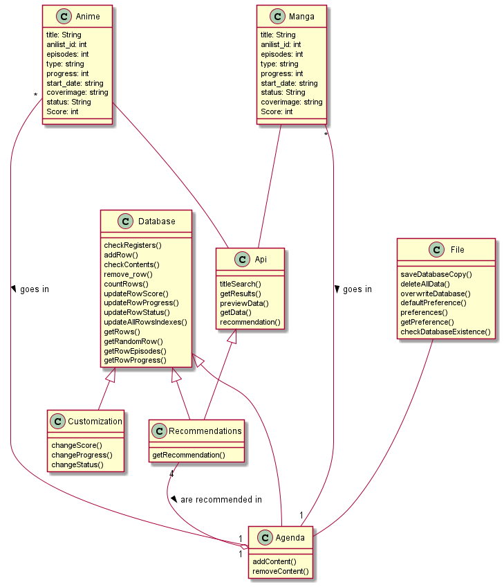

    

## UML diagram

  

 

## Functional requeriments

1. **Search for a specific title**: For starting an agenda or tracker, users want to look and see if a specific anime or manga is available.

## How to use

Click on the button 'Code' and download the .zip folder with the project, or just open a terminal and type:

`git clone https://github.com/Torrex123/Animack.git`

Intall the requirements in the `requirements.txt` file, execute the file `main.py` and start using the app via terminal.
